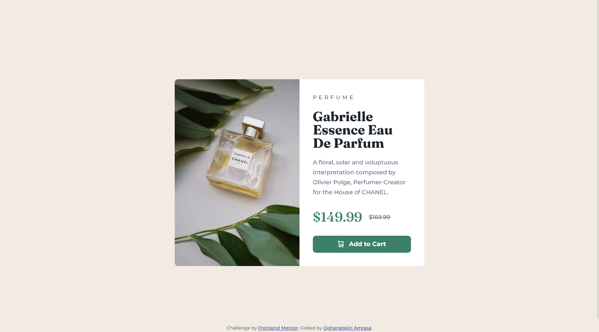
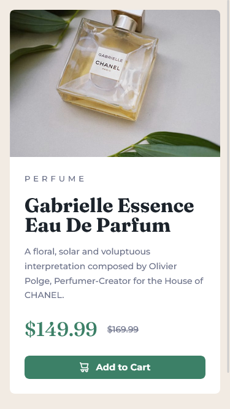

# Frontend Mentor - Product preview card component solution

This is a solution to the [Product preview card component challenge on Frontend Mentor](https://www.frontendmentor.io/challenges/product-preview-card-component-GO7UmttRfa). Frontend Mentor challenges help you improve your coding skills by building realistic projects. 

## Table of contents

- [Overview](#overview)
  - [The challenge](#the-challenge)
  - [Screenshot](#screenshot)
  - [Links](#links)
- [My process](#my-process)
  - [Built with](#built-with)
  - [What I learned](#what-i-learned)
  - [Continued development](#continued-development)
  - [Useful resources](#useful-resources)
- [Author](#author)
- [Acknowledgments](#acknowledgments)

## Overview

### The challenge

Users should be able to:

- View the optimal layout depending on their device's screen size
- See hover and focus states for interactive elements

### Screenshot

### Links

- Solution URL: [Add solution URL here](https://your-solution-url.com)
- Live Site URL: [Add live site URL here](https://your-live-site-url.com)

## My process

### Built with

- Semantic HTML5 markup
- CSS custom properties
- Flexbox
- CSS Grid
- Mobile-first workflow

**Note: These are just examples. Delete this note and replace the list above with your own choices**

### What I learned

In this project, I learned how to display images based on the screen size of the viewer's device using html picture and source element. 
<picture class="product__image">
          <source srcset="images/image-product-desktop.jpg", media="(min-width: 600px)">
          
        </picture>
I learned how to hide text visually to make it avalailable for screenreaders only ussing css pseudo classes

.visually-hidden:not(:focus):not(:active) {
  clip: rect(0 0 0 0);
  clip-path: inset(50%);
  height: 1px;
  overflow: hidden;
  position: absolute;
  white-space: nowrap;
  width: 1px;
}

Finally, I learned how to add the shopping icon to the button using html datablcoks and css
The html snippet:
<button class="button" data-icon="shopping-cart">Add to Cart</button>

The css snippet:
.button[data-icon="shopping-cart"]::before {
  content: "";
  background-image: url(./images/icon-cart.svg);
  width: 15px;
  height: 16px;
}

### Continued development

I'll be making more use of the picture and source elements.

### Useful resources

- [Taking on a Frontend Mentor challenge | Responsive Product Preview Card Component](https://www.youtube.com/watch?v=B2WL6KkqhLQ) - This tutorial proved invaluable throughout this project.
They equipped me with efficient approaches to CSS styling.
- [Inclusively Hidden](https://www.scottohara.me/blog/2017/04/14/inclusively-hidden.html) - This is an excellent article that provided a clear explanation of techniques for visually hiding content. It greatly enhanced my understanding in this area
- [How you can simplify your CSS with :is()](https://www.youtube.com/watch?v=McC4QkCvbaY) - In a video by Kevin Powell, he offers a comprehensive explanation of the CSS pseudo-class :is()
- [The HTML picture element explained [ Images on the web part 3 ]](https://www.youtube.com/watch?v=Rik3gHT24AM) - In this video, Kevin Powell explores the HTML picture element and its applications.

## Author

- Website - [Add your name here](https://www.your-site.com)
- Frontend Mentor - [@yourusername](https://www.frontendmentor.io/profile/yourusername)
- Twitter - [@yourusername](https://www.twitter.com/yourusername)

## Acknowledgments

I would like to express my gratitude to Mr. Kevin Powell for his high-quality CSS tutorials and his contributions to the Frontend Mentor challenges.

